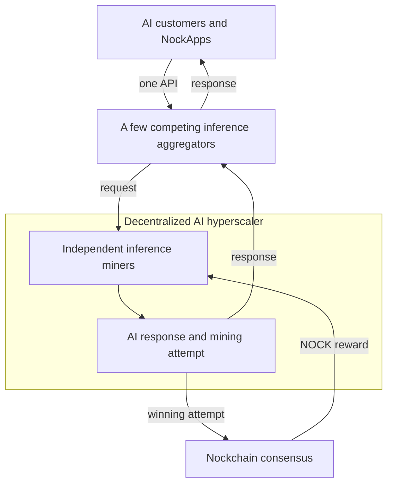

# The AI Compute Network

**The AI Compute Network lets useful AI inference power Nockchain’s programmable money. Independent AI providers serve customers through a few competing aggregators. The providers earn customer payments and can earn NOCK with the same inference work.**

This model creates a decentralized AI hyperscaler. Many independent operators supply the GPUs and models. Nockchain turns their useful computation into consensus work.

## The Product

Customers should not need to find every provider or connect to every model server. We intend to give them access through a small number of competing **inference aggregators**.

An aggregator gives customers one API, one model catalog, routing, billing, monitoring, and failover. The aggregator selects a provider for each request. It can consider the model, price, location, speed, and available capacity.

An **inference miner** runs AI models and serves requests from aggregators. The miner also uses the inference work for Nockchain mining.

A customer or NockApp uses a normal AI API. The aggregator handles the providers behind that API. The customer does not need to understand mining or interact with Nockchain.

We intend to support a few aggregators instead of one required aggregator. Aggregators can compete on price, model access, routing, reliability, and customer experience. Inference miners can connect to several aggregators. Customers can switch between them.

This structure gives users a simple product. It keeps the GPUs and model servers under independent control.

## How One Request Works

AI models use matrix multiplication to produce responses. The AI Compute Network uses selected matrix work as a Proof of Useful Work mining attempt.

One request follows five steps:

1. A customer sends an inference request to an aggregator.
2. The aggregator selects an inference miner.
3. The inference miner runs the model. The same matrix work produces the AI response and a Nockchain mining attempt.
4. The aggregator returns the response to the customer.
5. If the mining attempt wins, the inference miner creates a compact proof, submits a block, and earns NOCK.

Most attempts do not produce a block. They still produce useful AI responses. Nockchain does not pay for every request. It rewards the inference miner that produces an accepted block.

The inference miner does not run an unrelated mining task after the inference. The useful AI computation is the mining work.

## Why Inference Miners Join

An inference miner can receive two kinds of revenue from the same GPU work:

1. Customer payments for AI inference.
2. A chance to earn NOCK block rewards.

The additional expected revenue can lower inference costs, improve margins, or fund more GPU capacity. It can also help miners keep capacity available while customer demand grows.

This incentive attracts independent operators. More operators give aggregators more models, locations, and available capacity. Their combined capacity can grow to cloud scale without placing all GPUs under one company.

## How It Fits Into Nockchain

The AI Compute Network is one part of the power behind Nockchain’s programmable money. Each Compute Network defines a Proof of Useful Work puzzle that can produce Nockchain blocks.

Nockchain provides block candidates, mining targets, proof verification, and NOCK rewards. Inference aggregators provide the customer-facing cloud service.

This separation gives each part a clear role:

- Aggregators make the inference cloud easy to use.
- Inference miners provide useful AI compute.
- Nockchain turns that compute into consensus work.
- NOCK rewards the miners that produce accepted blocks.
- NockApps can buy inference through the aggregators.

More inference demand produces more useful mining work. More inference miners increase the cloud capacity available through each aggregator.

The AI Compute Network connects independent providers and customer demand to Nockchain consensus. Their combined capacity can grow to cloud scale, while NOCK and NockApps remain the monetary and programmable layers.

## How It Fits Together

Aggregators give users one interface to many inference miners. Customer payments support AI service. NOCK rewards pay miners for using the same compute to power and secure programmable money.
