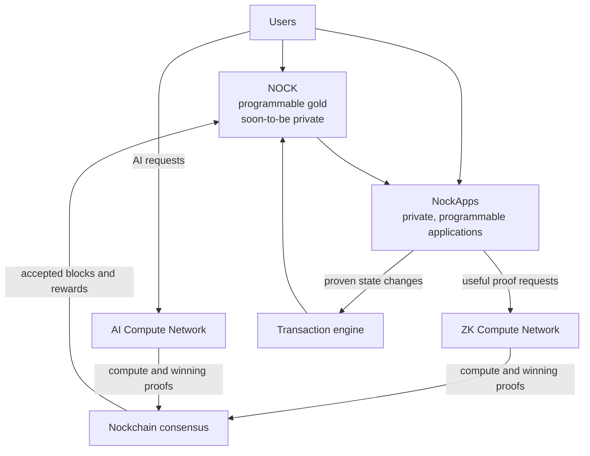

# Nockchain

**Private, programmable money powered by energy and Compute. NOCK is programmable gold, soon-to-be private. NockApps give the Nockchain economy private, programmable applications. Compute Networks turn computation into the work that secures the chain.**

The design has three parts:

1. **Money.** NOCK is the native money of Nockchain.
2. **NockApps.** NockApps are private, programmable applications for the Nockchain economy.
3. **Compute Networks.** Compute Networks coordinate independent providers and use their computation for consensus.

A block must pass both consensus and transaction validation before nodes accept it. Compute Networks provide the consensus work. The transaction engine enforces transfers and, in the proposed NockApp design, verifies proven program results.

## Money

NOCK is the common asset that connects users, applications, miners, and compute providers.

Users can hold and transfer NOCK. Nockchain issues block rewards in NOCK. A miner earns a reward when its Compute Network work produces an accepted block.

NOCK is programmable gold, soon-to-be private. NockApps can use NOCK in applications written as Nock programs.

The monetary asset stays simple. NockApps provide the application layer.

## NockApps

A NockApp is an application written as a Nock program. The proposed NockApp system runs that program in the Nock ZKVM and produces a zero-knowledge proof, or ZKP, of the result.

The NockApp includes the proof in a transaction. The transaction engine verifies the proof without running the full program again. It can then accept the proven state change.

This design gives programmable money two important properties:

- **Programmable applications.** Developers can write any application that can be expressed as a Nock program. The transaction engine does not need a new built-in feature for each application.
- **Private inputs.** A NockApp can keep selected inputs outside the public transaction. Nodes receive the proof and any public result, but they do not need the private inputs to verify the application’s state change.

The current transaction engine does not yet verify general NockApp proofs. Nockchain plans to add this verification with the general-purpose Nock ZKVM.

## Compute Networks

A Compute Network defines a compute puzzle that can produce valid Nockchain blocks. Miners perform the task and check whether the result meets the network’s difficulty target. A winning miner submits a block and proof. Other nodes verify the proof.

Nockchain can support several Compute Networks at the same time. Each network has its own difficulty. Nockchain measures their work and adds it to the same chain total. Nodes accept the valid chain with the most total work.

This design lets different kinds of computation power the same programmable money.

### The AI Compute Network

The AI Compute Network uses matrix multiplication from AI inference. An AI provider can use the same computation to serve a customer and make a Nockchain mining attempt.

Most attempts do not produce a block. They still produce useful AI results. When an attempt meets the Nockchain target, the provider creates a proof, submits a block, and can earn NOCK.

The provider can receive customer payments and compete for block rewards with the same GPU work. Independent providers can combine their capacity through competing inference aggregators without placing all GPUs under one company.

### The ZK Compute Network

Nockchain launched in May 2025 with a fixed ZK puzzle. Miners prove one fixed Nock program. This program does not produce a useful result for a customer.

The fixed puzzle tests whether ZKPs can secure Proof-of-Work consensus. It also rewards miners for making ZK proving faster and cheaper.

The proposed general-purpose ZK Compute Network replaces the fixed program with useful programs requested by NockApps and other customers. A ZK miner will be able to produce a customer’s Nock proof and use the same proof as a mining attempt.

The transaction engine and the general-purpose ZK Compute Network will use the same Nock proof format. One proof can therefore do two jobs:

1. Approve a programmable state change.
2. Compete to secure Nockchain and earn a block reward.

This shared proof connects Nockchain’s programmability directly to the compute that powers its consensus.

## The Economic Loop

Compute Networks turn customer demand and independent hardware into security for programmable money:

1. Users and NockApps request useful AI or ZK computation.
2. Independent providers perform the work.
3. Providers receive customer payments and use the same work for mining attempts.
4. Winning attempts produce Nockchain blocks and NOCK rewards.
5. Nockchain settles transfers and proven NockApp state changes.

More demand can support more compute providers. More providers can increase useful capacity and the work that secures Nockchain.

This is how Nockchain can coordinate decentralized hyperscalers without making the hyperscaler the product. The product is private, programmable money. Energy and the Compute Networks power it.

## Where Participants Fit

- **Users** hold and transfer NOCK, use NockApps, and buy services.
- **NockApp developers** build private, programmable applications as Nock programs.
- **AI providers** serve inference and use the same matrix work for mining attempts.
- **ZK provers** produce proofs and use the same proving work for mining attempts.
- **Aggregators and marketplaces** connect customers with independent compute providers.
- **Node operators** verify blocks, Compute Network proofs, transactions, and, after the proposed upgrade, NockApp proofs.

## How It Fits Together

Private, programmable money powered by energy and Compute.
