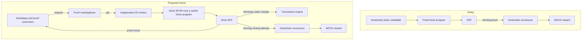

# The ZK Compute Network

**The ZK Compute Network makes zero-knowledge proving part of the power behind Nockchain’s programmable money. Today, miners secure the chain with a fixed ZK puzzle. The proposed future lets customer-requested proofs serve NockApps and act as mining attempts.**

This change has not happened yet. Today’s puzzle tests whether ZK proofs can secure Proof-of-Work consensus. The proposed design turns useful proving capacity into a decentralized ZK hyperscaler.

## How It Works Today

Nockchain launched the ZK Compute Network in May 2025. Miners prove the execution of one fixed Nock program. The program does not produce a useful result for an outside customer.

Current mining follows five steps:

1. A Nockchain node gives the miner a block candidate and mining target.
2. The miner runs the fixed program and creates a ZKP.
3. The miner checks whether the attempt meets the target.
4. A winning miner submits the proof and block to Nockchain.
5. Nockchain nodes verify the proof and reward the accepted block with NOCK.

The transaction engine does not yet verify general Nock proofs for NockApps.

Nockchain launched this fixed puzzle for two reasons:

1. Test ZK proofs as the work behind Proof-of-Work consensus.
2. Reward miners for making ZK proving faster and cheaper.

A more efficient miner can produce more attempts and compete for more blocks. This incentive has directed mining competition toward ZK prover performance.

## The Proposed Future

The proposed ZK Compute Network replaces the fixed program with useful Nock programs requested by customers.

The proposed design will use the Nock ZKVM to run any Nock program and produce a proof of its result. The proof lets another system verify the result without running the full program again.

Customers can request many kinds of proofs:

- NockApps can prove private and programmable state changes.
- Bridges can prove events from another network.
- Services can prove that they followed a required process.
- Developers can prove other computations written as Nock programs.

Proof marketplaces can connect customers with independent ZK miners. They can handle job discovery, pricing, payments, and service monitoring. Nockchain will provide the shared proof and mining rules.

The proposed transaction engine upgrade will verify the same Nock proof format that miners use for consensus. Nodes will verify NockApp state changes without running the full NockApp program.

This gives NockApps general programmability. It also lets them keep private inputs off the public chain. Nodes receive the proof and any public result, but they do not need the private inputs.

## How One Future Proof Request Works

One future request will follow five steps:

1. A customer requests a proof through a proof marketplace.
2. A ZK miner runs the customer’s Nock program in the Nock ZKVM.
3. The ZK miner produces a Nock ZKP and returns it to the customer.
4. The customer uses the proof for a NockApp transaction or another service.
5. If the proof wins the mining attempt, the ZK miner submits a block and earns NOCK.

Most useful proofs will not produce a block. They will still provide the result that the customer requested.

The ZK miner will not create a customer proof and then perform unrelated mining work. The useful proof will be the mining attempt.

## Why ZK Miners Participate

Today, ZK miners compete for NOCK block rewards. Faster proving creates more mining attempts.

In the proposed future, a ZK miner can receive two kinds of revenue from the same proving work:

1. Customer payments for useful proofs.
2. A chance to earn NOCK block rewards.

The additional expected revenue can lower proof prices, improve margins, or fund more proving hardware. More miners give customers more capacity, faster service, and more choice.

Their combined capacity can grow to cloud scale without placing all proving hardware under one company. This creates a decentralized ZK hyperscaler.

## How It Fits Into Nockchain

The ZK Compute Network is one part of the power behind Nockchain’s programmable money. Each Compute Network defines work that can produce Nockchain blocks.

Today, the ZK Compute Network uses one fixed program only for consensus mining.

The proposed design will use the same Nock proof format in two places:

- The ZK Compute Network will use it for consensus mining.
- The transaction engine will use it to verify NockApp state changes.

This shared format will connect Nockchain’s programs directly to the compute that powers consensus. More NockApp activity will create more demand for useful proofs. More proof demand will create more consensus work.

Nockchain will provide block candidates, mining targets, proof verification, and NOCK rewards. Proof marketplaces and NockApps will provide the customer-facing products.

## How It Fits Together

Today, NOCK rewards miners for proving one fixed program. The proposed design lets customer proofs verify NockApp state changes and uses the same proving work to power consensus.
